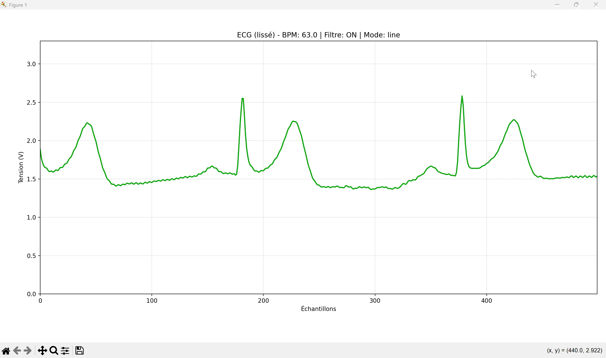

# 🫀 Projet ECG en temps réel avec STM32 Nucleo & Python

## 📖 Description

Ce projet permet de mesurer et d’afficher **un signal ECG en temps réel** à l’aide d’une carte **STM32 Nucleo-L152RE** connectée à un **capteur ECG DFRobot Gravity** et à **trois électrodes**.  
Les données analogiques captées par les électrodes sont converties en numérique par la carte, puis envoyées via le port série à un script **Python** qui trace le signal ECG en direct.

---

## ⚙️ Matériel utilisé

| Composant | Rôle |
|------------|------|
| 🧠 **STM32 Nucleo-L152RE** | Microcontrôleur principal (conversion ADC + envoi série) |
| 💓 **DFRobot Gravity Heart Rate (ECG)** | Amplification et filtrage du signal cardiaque |
| ⚡ **3 électrodes ECG** | Capture du signal électrique du cœur (bras droit, bras gauche, jambe droite) |
| 🔌 **Câble USB** | Alimentation et communication série avec le PC |

---

## 🧩 Fonctionnement

### Chaîne de traitement :

Électrodes ECG 

Module DFRobot (amplification + filtrage analogique)

Carte STM32 Nucleo (conversion analogique → numérique via ADC)

Transmission série USB (COMx)

Script Python (PySerial + Matplotlib)

Affichage temps réel du signal ECG


---

## 💻 Code embarqué (STM32 / Mbed OS)

```cpp
#include "mbed.h"

AnalogIn ecg_pin(A0);
Serial pc(USBTX, USBRX);

int main() {
    pc.baud(115200);
    while (true) {
        float value = ecg_pin.read();  // entre 0.0 et 1.0
        value *= 3.3;                  // conversion en volts
        pc.printf("%.3f\n", value);    // envoi via le port série
        thread_sleep_for(5);           // ~200 Hz d’échantillonnage
    }
}
```

🎥 Aperçu du signal ECG capté par les électrodes et traité par la carte STM32 :


📊 Résultat final
Signal ECG fluide et lisible.

Affichage en temps réel à environ 200 Hz.

Interface légère et portable sur n’importe quel PC avec Python et PySerial.

## 🚀 Installation

### 1. Cloner le dépôt
```bash
git clone https://github.com/<ton_nom_utilisateur>/ECG-Nucleo.git
cd ECG-Nucleo
```

### 2. Installer les dépendances Python
```bash
pip install pyserial matplotlib
```

### 3. Connecter la carte STM32
Branche la carte Nucleo-L152RE à ton PC via USB
et vérifie le port COM utilisé (ex : COM3, COM5, etc.).

4. Lancer le script
```bash
python ecg_plot.py
```
Une fenêtre matplotlib s’ouvre et affiche le signal ECG en temps réel.


## 🧠 Auteur

📍 Projet réalisé dans le cadre du cours de **Systèmes d’Exploitation – ISEN 4A**  
📅 **Année : 2025**
